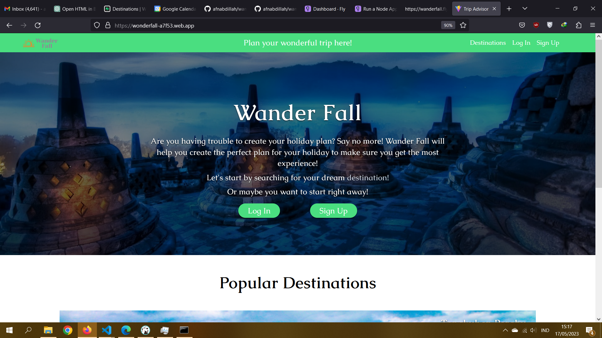

# Wanderfall

Wanderfall is a project aimed at simplifying the process of creating holiday plan schedules by integrating with Google Calendar. The purpose of Wanderfall is to provide users with a convenient platform to plan their holidays and seamlessly sync their schedules with their Google Calendar.

## What is this project about?

Wanderfall simplifies holiday planning by seamlessly integrating with your Google Calendar. With an intuitive user interface, it allows you to create and organize your holiday plans effortlessly. Add destinations, activities, and dates to create a personalized itinerary.

The key feature of Wanderfall is its seamless integration with Google Calendar. By connecting to your Google account, your holiday plans are automatically synced, ensuring easy access across devices. With Wanderfall, manual entry is eliminated, and your travel details are readily available.

Wanderfall offers additional features like reviews, where you can share your own experience with your holiday destination.

Experience stress-free holiday planning with Wanderfall. Create, manage, and sync your holiday schedule with ease, ensuring an enjoyable travel experience.

Note: The integration with Google Calendar allows for automatic syncing of schedules across devices.

# Screenshots

## Home Page

## Login Page

You can also login using your google account here.

.png)

## Register Page

.png)

## Find Your Favorite Destinations!

.png)

## You can Add Your Plan and Review Here!

.png)

## Photo Gallery

.png)

## Read Other People's Experience and Add Your Own Here!

.png)

## Describe Your Activities during Your Holiday

.png)

## And You will See Your Own Plan Here!

.png)

## You can Also See It on Google Calendar!

.png)
